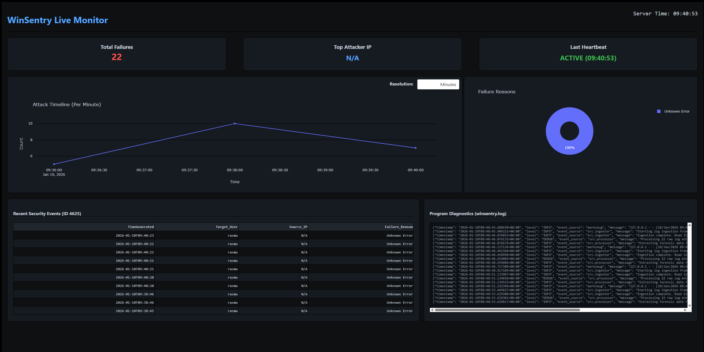

<div align="center">
  
  <p>
    <b>Windows Security Log Analyzer</b>
  </p>
  <br>
</div>

**WinSentry** is a robust, automated cybersecurity tool designed to ingest, normalize, and visualize Windows Event Logs in real-time. This application transforms unstructured security data (specifically Event ID 4625) into actionable intelligence via an interactive web dashboard.

# Important!

**This program requires administrator privileges to function properly.**
The included launcher (`Run.bat`) will automatically request these privileges when started.

## 🔭 Project Overview
The primary mission of WinSentry is to detect potential security threats, such as brute-force attacks, by monitoring the Windows Security Log. Unlike simple scripts, WinSentry utilizes a **defensive programming architecture** to ensure resilience against crashes and environment errors.

It reads raw Windows Event Logs via the Win32 API, parses complex message strings using Regular Expressions (Regex), and visualizes the data using **Dash** and **Pandas**.

## 📋 Table of Contents
- [Project Overview](#-project-overview)
- [Roadmap](#-roadmap)
- [Preview](#-preview)
- [Key Features](#-key-features)
- [System Requirements](#-system-requirements)
- [Installation](#%EF%B8%8F-installation)
- [Usage](#-usage)
- [Configuration](#%EF%B8%8F-installation)
- [Autostart & Background Service](#-autostart--background-service)
- [Logging](#-logging--diagnostics)
- [Documentation](#-documentation)

## 🗺 Roadmap

| Version | Status | Focus | Key Features |
| :--- | :--- | :--- | :--- |
| **v0.1.0** | ✅ **Completed** | **MVP (Core)** | • Log Ingestion (ID 4625)<br>• Web Dashboard (Dash)<br>• JSON Structured Logging<br>• Admin Auto-elevation<br>• Centralized Config<br>• Available test script |
| **v0.2.0** | 🚧 *In Progress* | **Optimization** | • Filter by Date Range in Dashboard<br>• Export Report to CSV/PDF<br>• Support for more Event ID:s |
| **v0.3.0** | 🔮 *Planned* | **Advanced Analysis** | • IP Geolocation Mapping<br>• Email Alerts for High Failure Rate<br>• Multi-Server Log Aggregation |
| **v1.0.0** | 🔮 *Planned* | **Production** | • Docker Containerization<br>• User Authentication for Dashboard<br>• SIEM Forwarder Integration |

## 📸 Preview

<div align="center">
  
  <p><i>Real-time monitoring dashboard showing attack timeline and KPIs</i></p>
</div>
<br>

## ✨ Key Features
* **Live Data Ingestion:** Real-time reading of Windows Event Logs using `pywin32`.
* **Forensic Normalization:** Extracts critical data (IP Address, User Account, Failure Status) from unstructured text using advanced Regex.
* **Interactive Dashboard:** A web-based UI built with Dash/Plotly displaying security KPIs, attack timelines, and a live heartbeat.
* **Background Service:** Can be installed to run silently at system startup (Session 0) to monitor threats 24/7.
* **Centralized Configuration:** Easy management of ports, logging intervals, and data retention via a single config file.
* **Structured Logging:** All internal application events are logged in JSON format for full traceability.

## 💻 System Requirements
Due to reliance on the Windows API (`win32evtlog`), this application has strict platform requirements:

* **OS:** Windows 10 or Windows 11.
* **Python:** Version 3.9 or higher.
* **Privileges:** **Administrator rights are mandatory** to access the Windows `Security` event log.

## ⚙️ Installation

1. **Clone the Repository**
    ```bash
    git clone [https://github.com/rasmusjonsson404/WinSentry.git](https://github.com/rasmusjonsson404/WinSentry.git)
    cd WinSentry
    ```

2. **Setup Environment** \
    Run `Setup.bat` to automatically create a virtual environment (`.venv`) and install all required libraries.

## 🚀 Usage

Double-click `Run.bat` to start the application. It will automatically ask for Admin privileges and open the main menu.

**Menu Options:**
1. **Run WinSentry (Dashboard Mode):** Starts the web server and opens the dashboard in your browser.
2. **Run WinSentry (Terminal Mode):** Runs a lightweight text-only monitor in the console.
3. **Show Help:** Displays CLI arguments.
4. **Run with Arguments:** Allows you to manually type flags (e.g., `-t` or `--stop`).
5. **Add to Windows Startup:** Installs WinSentry as a hidden background service that starts when the computer boots.
6. **Remove from Windows Startup:** Uninstalls the background task.
7. **Stop Background Service:** Immediately stops the hidden background process.
8. **Generate Events:** Generate N events for login to see data.
9. **Erase logs:** Erase the logs to test the program from 0.
11. **Check version:** Check current version of program.
10. **Quit:** Exits the launcher.

### Generate test events

Test events can be generated by the user. Use `Run.bat` and choose option 8 or run this command in the terminal inside the project folder:
  ```bash
  call .venv\Scripts\activate
  python test\generate_events.py
  ```

## ⚙️ Configuration
You do not need to edit the source code to change settings. 
Once the program runs for the first time, a file named `config/settings.conf` is generated.

You can edit this file to change:
* **Dashboard Port:** Change the web server port (Default: 8050).
* **Refresh Rate:** How often the dashboard updates (Default: 5 seconds).
* **Log Retention:** How many days to keep logs before deleting them.
* **Log Rotation:** How often to create new log files (e.g., Midnight).

**Example `settings.conf`:**
```ini
[LOGGING]
when = midnight
interval = 1
backup_count = 30

[DASHBOARD]
port = 8050
refresh_interval = 5
max_events = 200
```

## 🛡 Autostart & Background Service

WinSentry can be scheduled to run automatically when Windows starts.

* **How it works:** It uses the Windows Task Scheduler to run the script `ONSTART` (System Boot).
* **Visibility:** It runs in **Session 0** (Background), meaning no terminal window will be visible.
* **Monitoring:** To check if it's running, open your browser and go to `http://127.0.0.1:8050` (or your configured port).
* **Stopping:** Since there is no window to close, use **Option 7** in `Run.bat` to stop the service.

## 📝 Logging & Diagnostics
WinSentry includes a robust, enterprise-grade logging system designed for long-term operation and traceability.

### Storage & Format
* **Location:** All logs are stored in the `logs/` directory.
* **Format:** Logs are saved in **Structured JSON** format.

**Example Log Entry:**
```json
{
  "timestamp": "2026-01-06T14:30:00.123456+00:00",
  "level": "ERROR",
  "event_source": "src.ingestor",
  "message": "Failed to read event log.",
  "module": "ingestor",
  "line_number": 45,
  "traceback": "Traceback (most recent call last)..."
}
```
## 📚 Documentation
For more detailed information about the system architecture and implementation details, please refer to the `docs/` folder:

* **[System Architecture](docs/ARCHITECTURE.md):** High-level overview, data flow diagrams, and component descriptions.
* **[Technical Documentation](docs/DOCUMENTATION.md):** Detailed explanations of the codebase, modules, and error handling strategies.